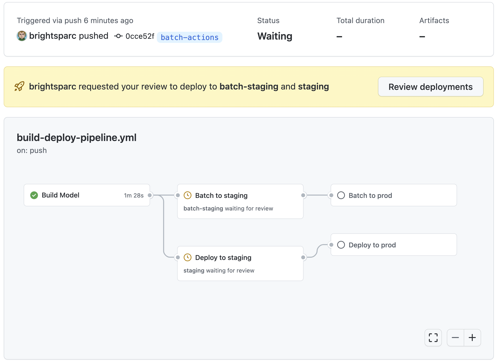

# AWS SageMaker Workflow for GitHub Actions

This template repository contains a sample application and sample GitHub Actions workflow files for continuously deploying both application code and infrastructure as code with GitHub Actions.

This MLOps workflow demonstrates training and evaluating a machine learning model to predict taxi fare from the public [New York City Taxi dataset](https://registry.opendata.aws/nyc-tlc-trip-records-pds/) deployed with Amazon SageMaker. 

This repository contains a number of start workflow files for GitHub Actions:
1. [build-pipeline.yml](./build-pipeline.yml) runs when a pull request is opened or updated.  This workflow creates or updates the Sagemaker Pipeline, and starts an execution.
1. [deploy-staging.yml](./deploy-staging.yml) runs when a new commit is pushed to the master branch for the `staging` environment.  This workflow deploys the SageMaker endpoint for staging. (WIP)
1. [deploy-prod.yml](./deploy-prod.yml) runs when a new commit is pushed to the master branch for the `production` environment.  This workflow deploys the Sagemaker endpoint for production. (WIP)
1. [publish-template.yml](./publish-template.yml) runs when a new commit is pushed to the master branch for the `public` environment.  Synths and uploads the CFN templates and build & deploy assets for launching the stack. 

## Create a GitHub repository from this template

Click the "Use this template" button above to create a new repository from this template.

Clone your new repository, and deploy the IAM resources needed to enable GitHub Actions to deploy CloudFormation templates:

```
aws cloudformation deploy \
  --stack-name amazon-sagemaker-workflow-for-github-actions \
  --template-file cloudformation/github-actions-setup.yml \
  --capabilities CAPABILITY_NAMED_IAM \
  --region us-east-1
```
You can review the permissions that your repository's GitHub Actions deployment workflow will have in the [setup.yml](cloudformation-templates/setup.yml) CloudFormation template.

Retrieve the IAM access key credentials that GitHub Actions will use for deployments:
```
aws secretsmanager get-secret-value \
  --secret-id github-actions-sagemaker \
  --region us-east-1 \
  --query SecretString \
  --output text
```

The GitHub Actions workflow has three stages: Model build, Deploy to staging, and Deploy to production.  Each has their on [environment](https://docs.github.com/en/actions/reference/environments) which secrets and optional protection rules. 
1. `development` This is the environment in which runs your Model Build and starts the SageMaker pipeline execution, and on completion it will publish a model to the Registry.  It is recommend you run this on `pull_request` and `push`.
1. `staging` This second stage deploys your Staging endpoint.  It is recommend you run this on commit to the `development` branch and configure a *protection rule* to continue after you have approved the model in the SageMaker Model Registry.
1. `prod` This final stage deploys you Production Endpoint. It is recommend you this on commit the `main` branch with a *protection rule* to require approval after Staging endpoint has been tested.

For each of the environments you will require setting up the following secrets.
1. Create a secret named `AWS_REGION` defaulted to region `us-east-1`
1. Create a secret named `AWS_ACCESS_KEY_ID` containing the `AccessKeyId` value returned above.
1. Create a secret named `AWS_SECRET_ACCESS_KEY` containing in the `SecretAccessKey` value returned above.
1. Create a secret named `AWS_SAGEMAKER_ROLE` containing the `SageMakerRoleArn` output in the setup stack.

If you configure *protection rules* for you environments, you will need to click **Review deployments** to approve the next stage as show below:



When the workflow successfully completes, you will have both Endpoints deployed in staging and production, with drift detection enable which will trigger re-training on drift.
