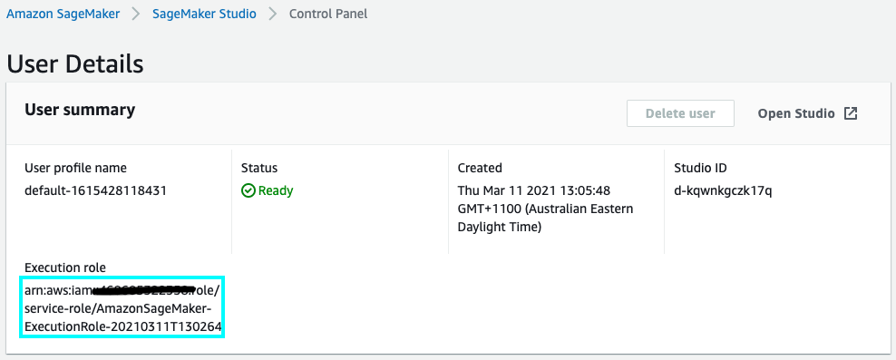
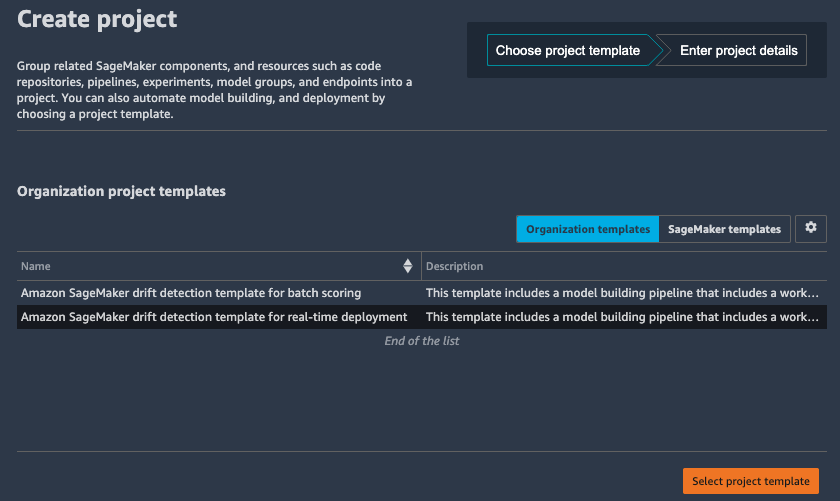

# Amazon SageMaker Drift Detection

This sample demonstrates how to setup an Amazon SageMaker MLOps deployment pipeline for Drift detection


The following are the high-level steps to deploy this solution:

1. Publish the SageMaker [MLOps Project template](https://docs.aws.amazon.com/sagemaker/latest/dg/sagemaker-projects-templates.html) in the [AWS Service Catalog](https://aws.amazon.com/servicecatalog/)
2. Create a new Project in [Amazon SageMaker Studio](https://docs.aws.amazon.com/sagemaker/latest/dg/sagemaker-projects-create.html)

Once complete, you can Train and Deploy machine learning models, and send traffic to the Endpoint to cause the Model Monitor to raise a drift alert.

## Get Started

Use this following AWS CloudFormation quick start to create a custom [SageMaker MLOps project](https://docs.aws.amazon.com/sagemaker/latest/dg/sagemaker-projects-templates-custom.html) template in the [AWS Service Catalog](https://aws.amazon.com/servicecatalog/) and configure the portfolio and products so you can launch the project from within your Studio domain.

[](https://console.aws.amazon.com/cloudformation/home?region=us-east-1#/stacks/quickcreate?templateUrl=https%3A%2F%2Famazon-sagemaker-safe-deployment-pipeline.s3.amazonaws.com%2Fdrift-pipeline%2Fcloudformation%2Fdrift-service-catalog.yml&stackName=drift-pipeline&param_ExecutionRoleArn=&param_PortfolioName=SageMaker%20Organization%20Templates&param_PortfolioOwner=administrator&param_ProductVersion=1.0)

Follow are the list of the parameters. 

| Parameters         | Description                                    |
| ------------------ | ---------------------------------------------- |
| ExecutionRoleArn   | The SageMaker Studio execution role (required) |
| PortfolioName      | The name of the portfolio                      |
| PortfolioOwner     | The owner of the portfolio                     |
| ProductVersion     | The product version to deploy                  |

You can copy the the required `ExecutionRoleArn` role from your **User Details** in the SageMaker Studio dashboard.



Alternatively see [BUILD.md](BUILD.md) for instructions on how to build the MLOps template from source.

## Creating a new Project in Amazon SageMaker Studio

Once your MLOps project template is registered in **AWS Service Catalog** you can create a project using your new template.

1. Switch back to the Launcher
2. Click **New Project** from the **ML tasks and components** section.

On the Create project page, SageMaker templates is chosen by default. This option lists the built-in templates. However, you want to use the template you published for Amazon SageMaker drift detection.

3. Choose **Organization templates**.
4. Choose **Amazon SageMaker drift detection template for real-time deployment**.
5. Choose **Select project template**.



`NOTE`: If you have recently updated your AWS Service Catalog Project, you may need to refresh SageMaker Studio to ensure it picks up the latest version of your template.

6. In the **Project details** section, for **Name**, enter **drift-pipeline**.
  - The project name must have 32 characters or fewer.
7. In the Project template parameter, for **RetrainSchedule**, input a validate [Cron Schedule](https://docs.aws.amazon.com/sagemaker/latest/dg/model-monitor-schedule-expression.html)
  - This defaults to `cron(0 12 1 * ? *)` which is the first day of every month.
8. Choose **Create project**.


`NOTE`: If the **Create project** button is not enabled, touch the value in the **RetrainSchedule** to allow continuing.

### Project Resources

The MLOps Drift Detection template will create the following AWS services and resources:

1. An [Amazon Simple Storage Service](https://aws.amazon.com/s3/) (Amazon S3) bucket is created for output model artifacts generated from the pipeline.

2. Two repositories are added to [AWS CodeCommit](https://aws.amazon.com/codecommit/):
  -  The first repository provides code to create a multi-step model building pipeline using [AWS CloudFormation](https://aws.amazon.com/cloudformation/).  The pipeline includes the following steps: data processing, model baseline, model training, model evaluation, and conditional model registration based on accuracy. The pipeline trains a linear regression model using the XGBoost algorithm on trip data from the [NYC Taxi Dataset](https://registry.opendata.aws/nyc-tlc-trip-records-pds/). This repository also includes the [build-pipeline.ipynb](build_pipeline/build-pipeline.ipynb) notebook to [Run the Pipeline](#run-the-pipeline) (see below)
  - The second repository contains code and configuration files for model deployment and monitoring. This repo also uses [AWS CodePipeline](https://aws.amazon.com/codepipeline/) and [CodeBuild](https://aws.amazon.com/codebuild/), which run an [AWS CloudFormation](https://aws.amazon.com/cloudformation/) template to create model endpoints for staging and production.  This repository includes the [prod-config.json](deployment_pipeline/prod-config.json) configure to set metrics and threshold for drift detection.

3. Two AWS CodePipeline pipelines:
  - The [model build pipeline](build_pipeline) creates or updates the pipeline definition and then starts a new execution with a custom [AWS Lambda](https://aws.amazon.com/lambda/) function whenever a new commit is made to the ModelBuild CodeCommit repository. The first time the CodePipeline is started, it will fail to complete expects input data to be uploaded to the Amazon S3 artifact bucket.
  - The [deployment pipeline](deployment_pipeline/README.md) automatically triggers whenever a new model version is added to the model registry and the status is marked as Approved. Models that are registered with Pending or Rejected statuses aren’t deployed.

4. [SageMaker Pipelines](https://aws.amazon.com/sagemaker/pipelines) uses the following resources:
  - This workflow contains the directed acyclic graph (DAG) that creates a baseline and training job in parallel following up with a step to evaluate the model.  Each step in the pipeline keeps track of the lineage and steps are cached for quickly re-running the pipeline.  
  - Within SageMaker Pipelines, the [SageMaker Model Registry](https://docs.aws.amazon.com/sagemaker/latest/dg/model-registry.html) tracks the model versions and respective artifacts, including the lineage and metadata for how they were created. Different model versions are grouped together under a model group, and new models registered to the registry are automatically versioned. The model registry also provides an approval workflow for model versions and supports deployment of models in different accounts. You can also use the model registry through the boto3 package.

5. Two SageMaker Endpoints:
  - After a model is approved in the registry, the artifact is automatically deployed to a staging endpoint followed by a manual approval step.
  - If approved, it’s deployed to a production endpoint in the same AWS account along with a Model Monitoring schedule configured to detect drift compared against the baseline.

6. Two [Amazon Event Bridge](https://aws.amazon.com/eventbridge/) Rules and [CloudWatch](https://aws.amazon.com/cloudwatch/) Alarm:
  - One scheduled rule configured to re-train the model on a regular schedule. 
  - One CloudWatch alarm that will trigger when drift is detected in the Model Monitor and trigger a rule to re-train the model.

You will see a summary of these resources in the project page including the Repositories and Pipelines.  The Model groups and Endpoints will become visible after we have completed running the pipeline.

## Run the Pipeline

Once your project is created, following the instructions to [Clone the Code Repository](https://docs.aws.amazon.com/sagemaker/latest/dg/sagemaker-projects-walkthrough.html#sagemaker-proejcts-walkthrough-clone)


1. Choose **Repositories**, and in the **Local path** column for the repository that ends with *build*, choose **clone repo....**
2. In the dialog box that appears, accept the defaults and choose **Clone repository**
3. When clone of the repository is complete, the local path appears in the **Local path** column. Click on the path to open the local folder that contains the repository code in SageMaker Studio.
4. Click on the [build-pipeline.ipynb](build_pipeline/build-pipeline.ipynb) file to open the notebook.

In the notebook, provide the **Project Name** in the first cell to get started:

```
project_name = "<<project_name>>"  # << Update this drift detection project
```

Then follow the series of steps in the notebook to run through the sample:

1. Fetch the [NYC Taxi Dataset](https://registry.opendata.aws/nyc-tlc-trip-records-pds/) and upload to S3
2. Start the model build pipeline
3. Review the training job performance
4. Update the [Model Registry](https://docs.aws.amazon.com/sagemaker/latest/dg/model-registry-approve.html) status to `Approved`
5. Deploy the model to Staging
6. Make predictions against the Staging Endpoint
7. Manually Approve the Staging endpoint in the [deployment pipeline](deployment_pipeline/README.md)
8. Deploy the model to Production
9. Make predictions against the Production Endpoint to cause the the Model Monitor to alarm on drift detection.

### Model Monitor

To [visualize the results](https://docs.aws.amazon.com/sagemaker/latest/dg/model-monitor-interpreting-visualize-results.html) of Model Monitoring in Amazon SageMaker Studio select the Production Endpoint from the **Components and registries** left navigation pane or from the **Endpoints** tab in the project summary.


Once the Model Monitor **Data Quality** schedule has completed its execution (usually about 10 minutes past the hour) you will be able to navigate to the **Monitoring job history** tab to see that *issue found* will be identified in the **Monitoring status** column.

## Running Costs

This section outlines cost considerations for running the Drift Detection Pipeline. Completing the pipeline will deploy an endpoint with 2 production variants which will cost less than $8 per day. Further cost breakdowns are below.

- **CodeBuild** – Charges per minute used. First 100 minutes each month come at no charge. For information on pricing beyond the first 100 minutes, see [AWS CodeBuild Pricing](https://aws.amazon.com/codebuild/pricing/).
- **CodeCommit** – $1/month if you didn't opt to use your own GitHub repository.
- **CodePipeline** – CodePipeline costs $1 per active pipeline* per month. Pipelines are free for the first 30 days after creation. More can be found at [AWS CodePipeline Pricing](https://aws.amazon.com/codepipeline/pricing/).
- **SageMaker** – Prices vary based on EC2 instance usage for the Notebook Instances, Model Hosting, Model Training and Model Monitoring; each charged per hour of use. For more information, see [Amazon SageMaker Pricing](https://aws.amazon.com/sagemaker/pricing/).
  - The three `mml.m5.xlarge` *baseline, training and evaluation jobs* run for approx 20 minutes at $0.23 an hour, and cost less than $1.
  - The one `ml.t2.medium` instance for staging *hosting* endpoint costs $0.056 per hour, or $1.34 per day.
  - The two `ml.m5.large` instances for production *hosting* endpoint at 2 x $0.115 per hour, or $5.52 per day.
  - The one `ml.m5.xlarge` instance for *model monitor* schedule at $0.23 an hour, and cost less than $1 per day.
- **S3** – Low cost, prices will vary depending on the size of the models/artifacts stored. The first 50 TB each month will cost only $0.023 per GB stored. For more information, see [Amazon S3 Pricing](https://aws.amazon.com/s3/pricing/).
- **Lambda** - Low cost, $0.20 per 1 million request see [AWS Lambda Pricing](https://aws.amazon.com/lambda/pricing/).

## Cleaning Up

The [build-pipeline.ipynb](build_pipeline/build-pipeline.ipynb) notebook includes cells that you can run to cleanup the resources.

1. SageMaker prod endpoint
2. SageMaker staging endpoint
3. SageMaker Pipeline Workflow and Model Package Group

You can also clean up resources using the [AWS Command Line Interface](http://aws.amazon.com/cli) (AWS CLI):

1. Delete the CloudFormation stack created to provision the Production endpoint:

```
aws cloudformation delete-stack --stack-name sagemaker-<<project_name>>-deploy-prod
```

2. Delete the CloudFormation stack created to provision the Staging endpoint:

```
aws cloudformation delete-stack --stack-name sagemaker-<<project_name>>-deploy-staging
```

3. Delete the CloudFormation stack created to provision the SageMaker Pipeline and Model Package Group:

```
aws cloudformation delete-stack --stack-name sagemaker-<<project_name>>-deploy-pipeline
```

4. Empty the S3 bucket containing the artifacts output from the drift deployment pipeline:

```
aws s3 rm --recursive s3://sagemaker-project-<<project_id>>-<<region_name>>
```

5. Delete the project, which removes the CloudFormation stack that created the deployment pipeline:

```
aws sagemaker delete-project --project-name <<project_name>>
```

6. Delete the AWS Service Catalog project template:

```
aws cloudformation delete-stack --stack-name <<drift-pipeline>>
```

## Security

See [CONTRIBUTING](CONTRIBUTING.md#security-issue-notifications) for more information.

## License

This library is licensed under the MIT-0 License. See the [LICENSE](LICENSE) file.
