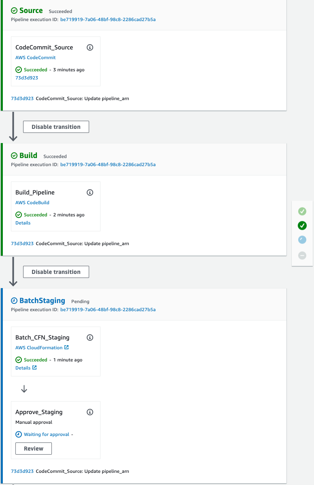

# Amazon SageMaker Drift Detection

This folder contains the code to create a batch pipeline that includes a SageMaker Transform Job and [Model Monitor](https://aws.amazon.com/sagemaker/model-monitor/) Processing Job.

## Build Pipeline

The model build pipeline contains three stages:
1. Source: This stage pulls the latest code from the **AWS CodeCommit** repository.
2. Build: The **AWS CodeBuild** action creates an Amazon SageMaker Pipeline definition and stores this definition as a JSON on S3. Take a look at the pipeline definition in the CodeCommit repository `pipelines/pipeline.py`. The build also creates an **AWS CloudFormation** template using the AWS CDK - take a look at the respective CDK App `app.py`.
3. BatchStaging: This stage executes the staging CloudFormation template to create/update a **SageMaker Pipeline** based on the latest approved model. The pipeline includes a manual approval gate, which triggers the deployment of the model to production.
4. BatchProd: This stage creates or updates a **SageMaker Pipelines** which includes a **SageMaker Model Monitor** and **Evaluate Drift Lambda** that will emit [CloudWatch Metrics](https://docs.aws.amazon.com/sagemaker/latest/dg/model-monitor-interpreting-cloudwatch.html) (see below) that will trigger a **CloudWatch Alarm** for drift detection against the previously queried data quality baseline.



### Metrics Published

CloudWatch Metrics are emitted with the following:
* Namespace `aws/sagemaker/ModelBuildingPipeline/data-metrics` 
* MetricName `feature_baseline_drift_<<feature_name>>`
* MetricValue `distance` from the baseline

### Starting the Batch Pipeline

The batch pipeline outlined above will be started when code is committed to the **AWS CodeCommit** repository or when a model is approved in the **SageMaker Model Registry**.

## Testing

Once you have created a SageMaker Project, you can test the **Build** stage.

### Build Stage

Export the environment variables for the `SAGEMAKER_PROJECT_NAME` and `SAGEMAKER_PROJECT_ID` created by your SageMaker Project cloud formation.

Then run the `python` command:

```
export SAGEMAKER_PROJECT_NAME="<<project_name>>"
export SAGEMAKER_PROJECT_ID="<<project_id>>"
export AWS_REGION="<<region>>"
export ARTIFACT_BUCKET="sagemaker-project-<<project_id>>-build-<<region>>"
export SAGEMAKER_PIPELINE_ROLE_ARN="<<service_catalog_product_use_role>>"
export EVALUATE_DRIFT_FUNCTION_ARN="sagemaker-<<project_name>-evaluate-drift"
cdk synth
```