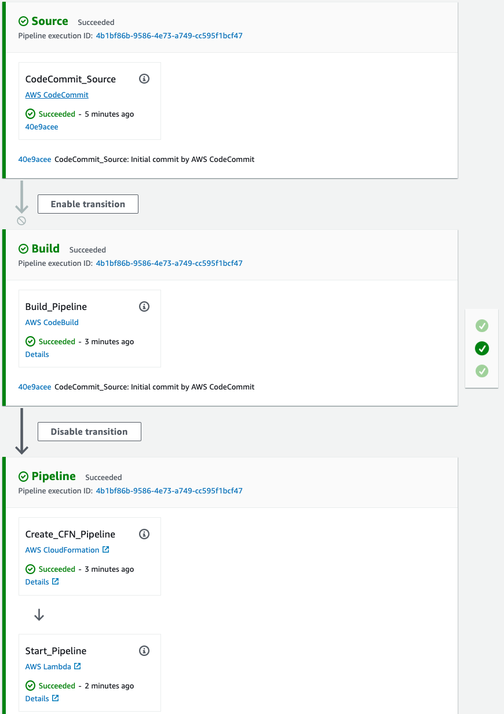
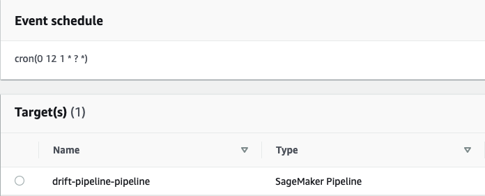
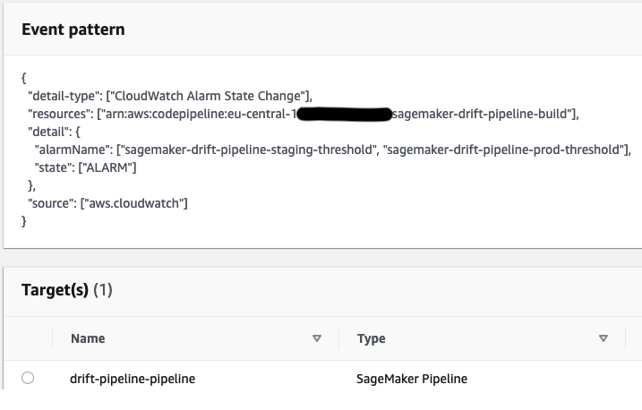

# Amazon SageMaker Drift Detection

This folder contains the code to create a model build pipeline that includes a SageMaker Baseline and Training Job.

## Build Pipeline

The model build pipeline contains three stages:
1. Source: This stage pulls the latest code from the **AWS CodeCommit** repository.
2. Build: The **AWS CodeBuild** action creates an Amazon SageMaker Pipeline definition and stores this definition as a JSON on S3. Take a look at the pipeline definition in the CodeCommit repository `build_pipeline/pipelines/pipeline.py`. The build also creates an **AWS CloudFormation** template using the AWS CDK - take a look at the respective CDK App `build_pipeline/app.py`.
3. Pipeline: This stage creates the **AWS CloudFormation** stack that has been synthesized in the  Build stage to create/update the Amazon SageMaker Pipeline. If successful, CodePipeline triggers an AWS Lambda function to start an execution of the SageMaker Pipeline to retrain our model. This Lambda function also disables the Build stage whilst the retraining pipeline is running.



The training data used in this example is set to a default bucket in the SageMaker Pipeline definition. You can copy additional records from the [NYC Taxi Dataset](https://registry.opendata.aws/nyc-tlc-trip-records-pds/) to the input folder like so:

```
aws s3 cp "s3://nyc-tlc/trip data/green_tripdata_2018-02.csv" s3://<<artifact-bucket>>/<<project-id>>/input/
```

### Triggering the model retraining

The full Model Build pipeline outlined above will start on the condition that code is committed to **AWS CodeCommit** repository. The model retraining workflow, the SageMaker Pipeline, has multiple triggers:
1. Code is committed to the **AWS CodeCommit** repository and the CloudFormation stack is successfully updated.
2. A scheduled AWS CloudWatch Events rule based on a [cron expression](https://docs.aws.amazon.com/eventbridge/latest/userguide/eb-create-rule-schedule.html#eb-cron-expressions).



3. A CloudWatch rule that is triggered by an Alarm when Model Monitor emits a [Baseline Drift](https://docs.aws.amazon.com/sagemaker/latest/dg/model-monitor-interpreting-cloudwatch.html) metric.



The payload for this event will include the *alarmName* and *reason*.

```
{
    "version": "0",
    "id": "ac2d4fbb-ccaa-4c95-4a82-55a9ff9a6b64",
    "detail-type": "CloudWatch Alarm State Change",
    "source": "aws.cloudwatch",
    "account": "<<account>>",
    "time": "2021-07-28T07:02:04Z",
    "region": "<<region>>",
    "resources": [
        "arn:aws:cloudwatch:<<region>>:<<account>>:alarm:sagemaker-<<project_name>>-prod-threshold"
    ],
    "detail": {
        "alarmName": "sagemaker-<<project_name>>-prod-threshold",
        "state": {
            "value": "ALARM",
            "reason": "Threshold Crossed: 1 out of the last 1 datapoints [0.85 was greater than the threshold (0.4) (minimum 1 datapoint for OK -> ALARM transition).",
            "timestamp": "2021-07-28T07:02:04.149+0000"
        },
        "configuration": {
            "description": "Schedule Metric > Threshold",
            "metrics": [
                {
                    "id": "febd7542-28c2-51f2-f869-82db1ccd7ee6",
                    "metricStat": {
                        "metric": {
                            "namespace": "aws/sagemaker/Endpoints/data-metrics",
                            "name": "feature_baseline_drift_fare_amount",
                            "dimensions": {
                                "Endpoint": "sagemaker-<<project_name>>-prod",
                                "MonitoringSchedule": "sagemaker-<<project_name>>-prod-threshold"
                            }
                        },
                        "period": 3600,
                        "stat": "Average"
                    },
                    "returnData": true
                }
            ]
        }
    }
}
```

When the Model Build pipeline has completed successfully, an AWS CloudWatch event will be published like so:

```
{
    "version": "0",
    "id": "1c5b01d5-46d8-4f5c-7f52-922609d259e0",
    "detail-type": "CodePipeline Pipeline Execution State Change",
    "source": "aws.codepipeline",
    "account": "<<account>>",
    "time": "2021-05-28T07:33:21Z",
    "region": "<<region>>",
    "resources": [
        "arn:aws:codepipeline:<<region>>:<<region>:sagemaker-<<project_name>>-build"
    ],
    "detail": {
        "pipeline": "sagemaker-<<project_name>>-build",
        "execution-id": "09714422-afff-4465-a5f8-651f1d80bba0",
        "state": "SUCCEEDED",
        "version": 2
    }
}
```

The SageMaker Pipeline will publish AWS CloudWatch events when it starts with `currentPipelineExecutionStatus` value of `Executing`.  And when it completes with a value of `Succeeded` or `Failed` like so:

```
{
    "version": "0",
    "id": "a732df3b-cedf-ed58-e8ca-0113c9cce39b",
    "detail-type": "SageMaker Model Building Pipeline Execution Status Change",
    "source": "aws.sagemaker",
    "account": "<<account>>",
    "time": "2021-05-28T07:46:07Z",
    "region": "<<region>>",
    "resources": [
        "arn:aws:sagemaker:<<region>>:<<account>>:pipeline/<<project_name>>-pipeline",
        "arn:aws:sagemaker:<<region>>:<<account>>:pipeline/<<project_name>>-pipeline/execution/<<execution_id>>"
    ],
    "detail": {
        "pipelineExecutionDescription": "SageMaker Drift Detection Pipeline",
        "pipelineExecutionDisplayName": "<<project_name>>-pipeline",
        "currentPipelineExecutionStatus": "Succeeded",
        "previousPipelineExecutionStatus": "Executing",
        "executionStartTime": "2021-05-28T07:33:35Z",
        "executionEndTime": "2021-05-28T07:46:07Z",
        "pipelineArn": "arn:aws:sagemaker:<<region>>:<<account>>:pipeline/<<project_name>>-pipeline",
        "pipelineExecutionArn": "arn:aws:sagemaker:<<region>>:<<account>>:pipeline/<<project_name>>-pipeline/execution/<<execution_id>>"
    }
}
```

An AWS CloudWatch Rule is configured to disable transitions in the Model Build pipeline, and disable Schedule/Drift CloudWatch rules whilst the SageMaker Pipeline is executing.

## Testing

Once you have created a SageMaker Project, you can test the **Build** stage.

### Build Stage

Export the environment variables for the `SAGEMAKER_PROJECT_NAME` and `SAGEMAKER_PROJECT_ID` created by your SageMaker Project cloud formation.

Then run the `python` command:

```
export SAGEMAKER_PROJECT_NAME="<<project_name>>"
export SAGEMAKER_PROJECT_ID="<<project_id>>"
export AWS_REGION="<<region>>"
export ARTIFACT_BUCKET="sagemaker-project-<<project_id>>-build-<<region>>"
export SAGEMAKER_PIPELINE_ROLE_ARN="<<service_catalog_product_use_role>>"
export SAGEMAKER_PIPELINE_NAME="<<project_name>>-pipeline"
export SAGEMAKER_PIPELINE_DESCRIPTION="SageMaker Drift Detection Pipeline"
cdk synth
```