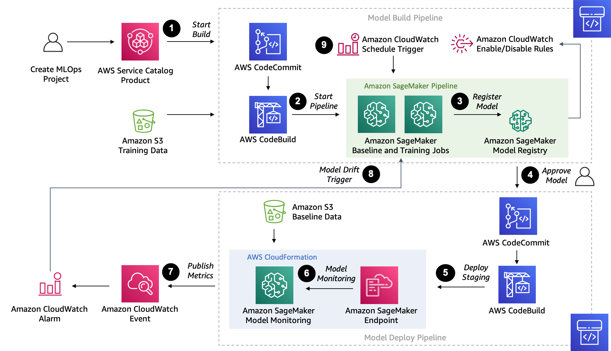
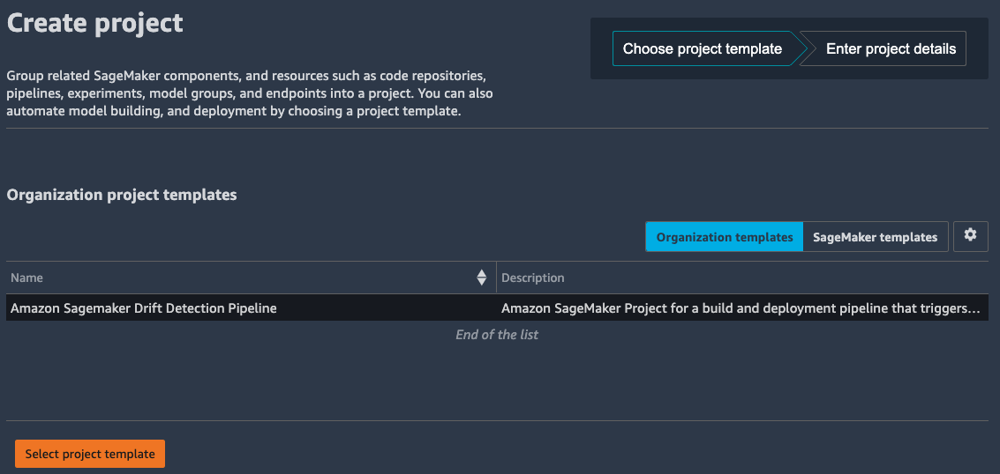
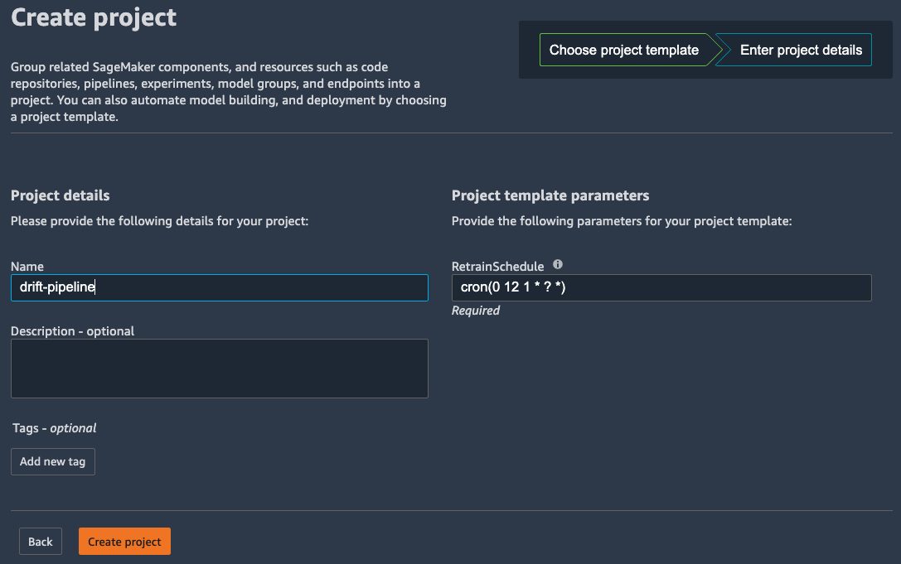
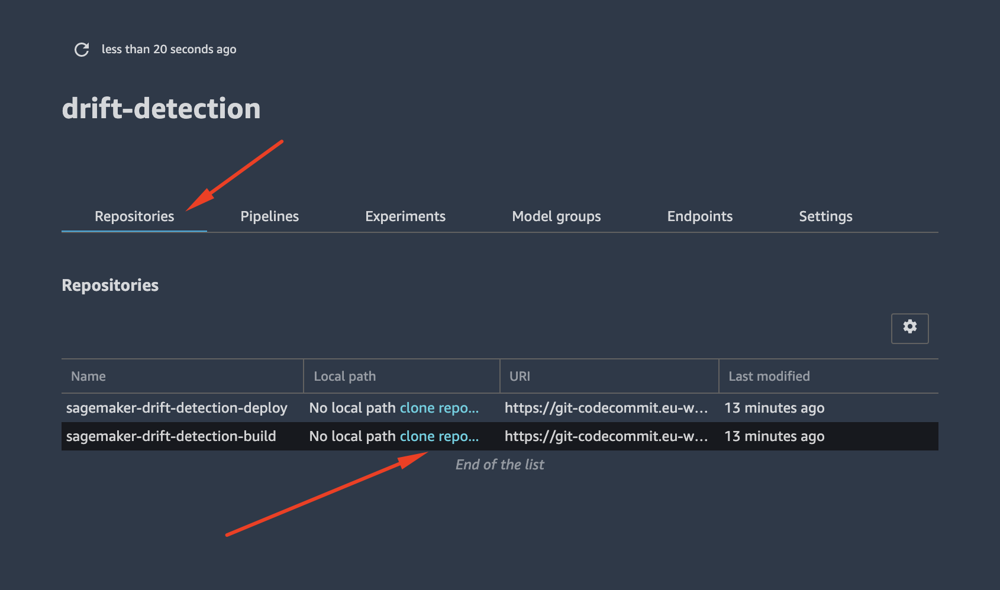
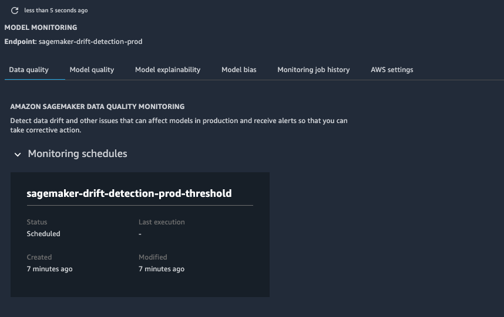

# Amazon SageMaker Drift Detection Pipeline

This sample demonstrates how to setup an Amazon SageMaker MLOps deployment pipeline for Drift detection


## Creating a new Project in Amazon SageMaker Studio

Once your MLOps project template is registered in **AWS Service Catalog** you can create a project using your new template.

1. Switch back to the Launcher
2. Click **New Project** from the **ML tasks and components** section.

On the Create project page, SageMaker templates is chosen by default. This option lists the built-in templates. However, you want to use the template you published for the Amazon SageMaker Drift Detection Pipeline.

6. Choose **Organization templates**.
7. Choose **Amazon SageMaker Drift Detection Pipeline**.
8. Choose **Select project template**.



`NOTE`: If you have recently updated your AWS Service Catalog Project, you may need to refresh SageMaker Studio to ensure it picks up the latest version of your template.

9. In the **Project details** section, for **Name**, enter **drift-pipeline**.
  - The project name must have 32 characters or fewer.
10. In the Project template parameters
  - For **RetrainSchedule**, input a validate [Cron Schedule](https://docs.aws.amazon.com/sagemaker/latest/dg/model-monitor-schedule-expression.html) which defaults to `cron(0 12 1 * ? *)` - the first day of every month.
11. Choose **Create project**.



`NOTE`: If the **Create project** button is not enabled, touch the value in the **RetrainSchedule** to allow continuing.

### Project Resources

The MLOps Drift Detection template will create the following AWS services and resources:

1. An [Amazon Simple Storage Service](https://aws.amazon.com/s3/) (Amazon S3) bucket is created for output model artifacts generated from the pipeline.

2. Two repositories are added to [AWS CodeCommit](https://aws.amazon.com/codecommit/):
  -  The first repository provides code to create a multi-step model building pipeline using [AWS CloudFormation](https://aws.amazon.com/cloudformation/).  The pipeline includes the following steps: data processing, model baseline, model training, model evaluation, and conditional model registration based on accuracy. The pipeline trains a linear regression model using the XGBoost algorithm on trip data from the [NYC Taxi Dataset](https://registry.opendata.aws/nyc-tlc-trip-records-pds/). This repository also includes the [drift-detection.ipynb](build_pipeline/drift-detection.ipynb) notebook to [Run the Pipeline](#run-the-pipeline) (see below)
  - The second repository contains code and configuration files for model deployment and monitoring. This repo also uses [AWS CodePipeline](https://aws.amazon.com/codepipeline/) and [CodeBuild](https://aws.amazon.com/codebuild/), which run an [AWS CloudFormation](https://aws.amazon.com/cloudformation/) template to create model endpoints for staging and production.  This repository includes the [prod-config.json](deployment_pipeline/prod-config.json) configure to set metrics and threshold for drift detection.

3. Two CodePipeline pipelines:
  - The [model build pipeline](build_pipeline) creates or updates the pipeline definition and then starts a new execution with a custom [AWS Lambda](https://aws.amazon.com/lambda/) function whenever a new commit is made to the ModelBuild CodeCommit repository. The first time the CodePipeline is started, it will fail to complete expects input data to be uploaded to the Amazon S3 artifact bucket.
  - The [deployment pipeline](deployment_pipeline/README.md) automatically triggers whenever a new model version is added to the model registry and the status is marked as Approved. Models that are registered with Pending or Rejected statuses aren’t deployed.

4. [SageMaker Pipelines](https://aws.amazon.com/sagemaker/pipelines) uses the following resources:
  - This workflow contains the directed acyclic graph (DAG) that creates a baseline and training job in parallel following up with a step to evaluate the model.  Each step in the pipeline keeps track of the lineage and steps are cached for quickly re-running the pipeline.  
  - Within SageMaker Pipelines, the [SageMaker Model Registry](https://docs.aws.amazon.com/sagemaker/latest/dg/model-registry.html) tracks the model versions and respective artifacts, including the lineage and metadata for how they were created. Different model versions are grouped together under a model group, and new models registered to the registry are automatically versioned. The model registry also provides an approval workflow for model versions and supports deployment of models in different accounts. You can also use the model registry through the boto3 package.

5. Two SageMaker Endpoints:
  - After a model is approved in the registry, the artifact is automatically deployed to a staging endpoint followed by a manual approval step.
  - If approved, it’s deployed to a production endpoint in the same AWS account along with a Model Monitoring schedule configured to detect drift compared against the baseline.

6. Two [Amazon Event Bridge](https://aws.amazon.com/eventbridge/) Rules and [CloudWatch](https://aws.amazon.com/cloudwatch/) Alarm:
  - One scheduled rule configured to re-train the model on a regular schedule. 
  - One CloudWatch alarm that will trigger when drift is detected in the Model Monitor and trigger a rule to re-train the model.

You will see a summary of these resources in the project page including the Repositories and Pipelines.  The Model groups and Endpoints will become visible after we have completed running the pipeline.

## Run the Pipeline

Once your project is created, following the instructions to [Clone the Code Repository](https://docs.aws.amazon.com/sagemaker/latest/dg/sagemaker-projects-walkthrough.html#sagemaker-proejcts-walkthrough-clone)



1. Choose **Repositories**, and in the **Local path** column for the repository that ends with *build*, choose **clone repo....**
2. In the dialog box that appears, accept the defaults and choose **Clone repository**
3. When clone of the repository is complete, the local path appears in the **Local path** column. Click on the path to open the local folder that contains the repository code in SageMaker Studio.
4. Click on the [drift-detection.ipynb](build_pipeline/drift-detection.ipynb) file to open the notebook.

In the notebook, provide the **Project Name** in the first cell to get started:

```
project_name = "<<project_name>>"  # << Update this drift detection project
```

Then follow the series of steps in the notebook to run through the sample:

1. Fetch the [NYC Taxi Dataset](https://registry.opendata.aws/nyc-tlc-trip-records-pds/) and upload to S3
2. Start the model build pipeline
3. Review the training job performance
4. Update the [Model Registry](https://docs.aws.amazon.com/sagemaker/latest/dg/model-registry-approve.html) status to `Approved`
5. Deploy the model to Staging
6. Make predictions against the Staging Endpoint
7. Manually Approve the Staging endpoint in the [deployment pipeline](deployment_pipeline/README.md)
8. Deploy the model to Production
9. Make predictions against the Production Endpoint to cause the the Model Monitor to alarm on drift detection.

### Model Monitor

To [visualize the results](https://docs.aws.amazon.com/sagemaker/latest/dg/model-monitor-interpreting-visualize-results.html) of Model Monitoring in Amazon SageMaker Studio select the Production Endpoint from the **Components and registries** left navigation pane or from the **Endpoints** tab in the project summary.



Once the Model Monitor **Data Quality** schedule has completed its execution (usually about 10 minutes past the hour) you will be able to navigate to the **Monitoring job history** tab to see that *issue found* will be identified in the **Monitoring status** column.
