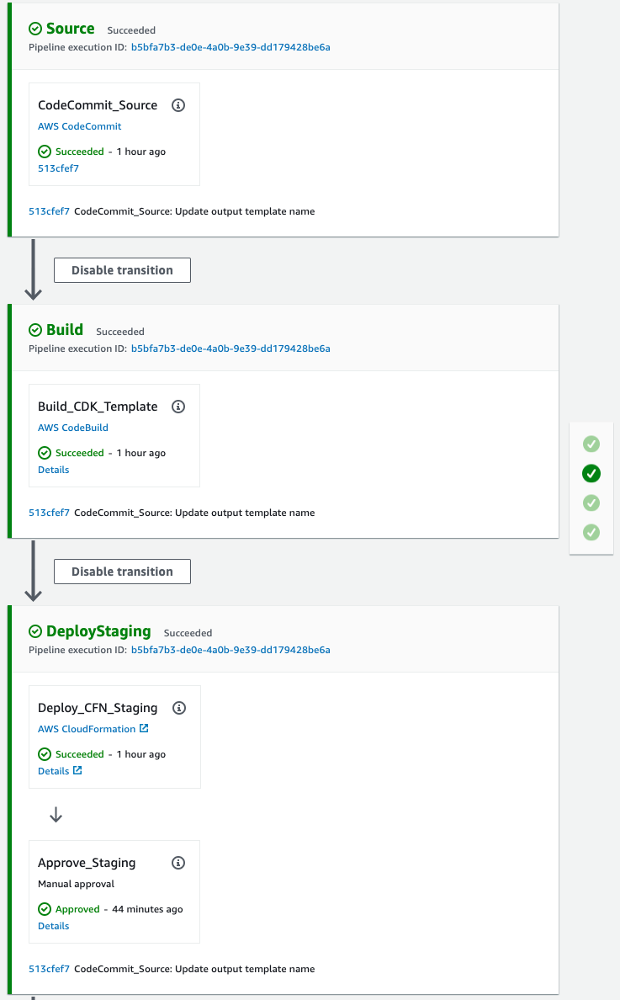
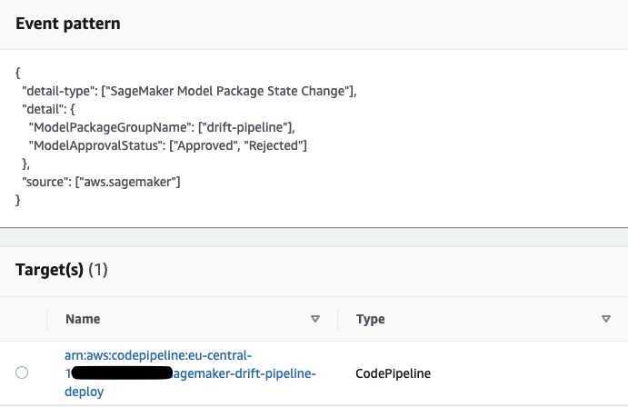

# Amazon SageMaker Drift Detection

This folder contains the code to create the infrastructure to deploy the SageMaker Endpoint and [Model Monitor](https://aws.amazon.com/sagemaker/model-monitor/) schedule.

## Deployment Pipeline

The deployment pipeline contains four stages:
1. Source: This stage pulls the latest code from the **AWS CodeCommit** repository.
2. Build: The **AWS CodeBuild** action runs the AWS CDK app that queries the **SageMaker Model Registry** for the latest approved model and the respective **SageMaker Pipeline** execution for the [Data Quality Baseline](https://docs.aws.amazon.com/sagemaker/latest/dg/model-monitor-create-baseline.html). Using the `staging-config.json` and `prod-config.json` the CDK app creates two **AWS CloudFormation** templates for the staging and production deployments respectively. Have a look at the CDK app `deployment_pipeline/app.py`.
3. DeployStaging Pipeline: This pipeline executes the staging CloudFormation template to create/update a **SageMaker Endpoint** based on the latest approved model. The pipeline includes a manual approval gate, which triggers the deployment of the model to production.
4. DeployProd Pipeline: This deployment creates or updates a **SageMaker Endpoint** with [Data Capture](https://docs.aws.amazon.com/sagemaker/latest/dg/model-monitor-data-capture.html) enabled, and also creates a [Model Monitoring Schedule](https://docs.aws.amazon.com/sagemaker/latest/dg/model-monitor-scheduling.html) which outputs **CloudWatch Metrics** (see below) and **CloudWatch Alarm** for drift detection against the previously queried data quality baseline.



### Metrics Published

CloudWatch Metrics are emitted with the following:
* Namespace `aws/sagemaker/Endpoints/data-metrics` 
* MetricName `feature_baseline_drift_<<feature_name>>`
* MetricValue `distance` from the baseline

### Starting the Deployment Pipeline

The deployment pipeline outlined above will be started when code is committed to the **AWS CodeCommit** repository or when a model is approved in the **SageMaker Model Registry** (see below the CloudWatch event below).

```
{
    "version": "0",
    "id": "c800a495-b000-072c-7392-c683e89c96a8",
    "detail-type": "SageMaker Model Package State Change",
    "source": "aws.sagemaker",
    "account": "<<account>>",
    "time": "2021-06-03T04:45:23Z",
    "region": "<<region>>",
    "resources": [
        "arn:aws:sagemaker:<<region>>:<<account>>:model-package/<<project_name>>/<<version>>"
    ],
    "detail": {
        "ModelPackageName": "<<project_name>>/<<version>>",
        "ModelPackageGroupName": "<<project_name>>",
        "ModelPackageVersion": <<version>>,
        "ModelPackageArn": "arn:aws:sagemaker:<<region>>:<<account>>:model-package/<<project_name>>/<<version>>",
        "CreationTime": 1622695255225,
        "InferenceSpecification": {
            "Containers": [
                {
                    "Image": "<<training-image>>",
                    "ImageDigest": "sha256:04889b02181f14632e19ef6c2a7d74bfe699ff4c7f44669a78834bc90b77fe5a",
                    "ModelDataUrl": "s3://sagemaker-project-<<project_id>>-build-<<region>>/<<project_id>>/model/pipelines-xxxxx/output/model.tar.gz"
                }
            ],
        },
        "ModelPackageStatus": "Completed",
        "ModelApprovalStatus": "Approved"
    }
}
```


## Testing

Once you have created a SageMaker Project, you can test the **Build** stage locally by setting some environment variables.

### Build Stage

Export the environment variables for the `SAGEMAKER_PROJECT_NAME` and `SAGEMAKER_PROJECT_ID` created by your SageMaker Project cloud formation.

Then run the `cdk synth` command:

```
export SAGEMAKER_PROJECT_NAME="<<project_name>>"
export SAGEMAKER_PROJECT_ID="<<project_id>>"
export SAGEMAKER_EXECUTION_ROLE_ARN="<<service_catalog_product_use_role>>"
cdk synth
```